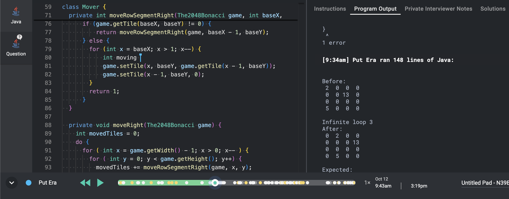

# 2048-bonacci
2048 is a tiny video game that was super hype some years ago. You had to fuse two equal numbers to create its double. So 1 and 1 became 2, 2 and 2 became 4, and so on.

Fibonacci was a famous mathematician who made the super-hype Fibonacci sequence you may have heard about: U(n+1) = U(n) + U(n-1). The first number of the sequence are 1, 1, 2, 3, 5, 8, 13, …

Let’s combine these two hype things to create a super-super-hype game!

2048-bonacci plays on a 4x4 square. Each square is either empty or contains a number of the Fibonacci sequence.

You are given an initial board situation (a 2D array of integers) and a pushing direction (up, left, down, or right). Then, you must compute the board contents after the push and return an updated 2D array of integers.

The value of integers in the array is guaranteed to be less than 2^16 and are all Fibonacci numbers. The value 0 means the square is empty.

Rule 1
Numbers move as far as possible in the pushing direction.

```
-------------                       -------------
| 2|  |  |  |                       |  |  |  |  |
-------------                       -------------
|  |  |13|  |                       |  |  |  |  |
-------------  => push downward =>  -------------
|  |  |  |  |                       | 2|  |  |  |
-------------                       -------------
| 5|  |  |  |                       | 5|  |13|  |
-------------                       -------------
```

Rule 2
When two consecutive numbers in the Fibonacci sequence are pushed one on another, they fuse into the next number.

```
-------------                       -------------
|  |  | 1| 2|                       |  |  |  | 3|
-------------                       -------------
| 1|  | 1|  |                       |  |  |  | 2|
-------------  => push rightward => -------------
|  | 8| 5|  |                       |  |  |  |13|
-------------                       -------------
|  | 5| 8|  |                       |  |  |  |13|
-------------                       -------------
```

Rule 3
Fusing orders are resolved in the backward direction of the push.

A fused number can not be fused once again in the same turn.

```
-------------                 -------------                 -------------
|  | 1| 2| 3|                 |  |  | 1| 5|                 |  |  | 1| 5|
-------------                 -------------                 -------------
|  | 3| 2| 1|                 |  |  | 3| 3|                 |  |  | 3| 3|
------------- => rightward => ------------- => rightward => -------------
|  |  |  |  |                 |  |  |  |  |                 |  |  |  |  |
-------------                 -------------                 -------------
|  | 5| 3| 5|                 |  |  | 5| 8|                 |  |  |  |13|
-------------                 -------------                 -------------
```
Rule 4
Numbers can move to a square that a fusing has just emptied.

```
-------------                     -------------
| 1|  |  |  |                     | 2|  |  |  |
-------------                     -------------
| 1|  |  |  |                     | 2|  |  |  |
-------------  => push upward =>  -------------
| 1|  |  |  |                     |  |  |  |  |
-------------                     -------------
| 1|  |  |  |                     |  |  |  |  |
-------------                     -------------
```
Let’s hype!

# Source

Sample program from https://app.coderpad.io/

- In coderapp all classes should be on the same Solution module. On this solution classes has been splited in to several different modules for clarity
- Since coderapp does not allow debug, it is a good idea to include debugging input/response/expected log cases at assert test stage.
- It is important to validate edge cases with ChatGPT by copying the original problem + the solution. Note that on this problem, the table was at first wrong, since it did not allowed the 1+1 case and the combinations on both orders (missing test cases)

# Strategies

- There are 4 movement cases: up, down, left, right. Coding each one separately is so long and time consuming. Best idea here is to generalize it by using the concepts of initial position, final position, delta movements and limits.
- It is good to define from the beginning a parameterized test, so several different cases can be tested with less biler plate code.
- First and other rules are just two cases under the same structure.

# Performance report



- Total time taken: 8:56pm -> 10:14pm + 9:22am -> 12:49pm + 12:53pm -> 3:19pm. TOTAL: 7h11min (78+207+146 = 431min)
- ChatGPT opinion: should take 90 minutes :(
- Cheat: there was a copy-pasted version on the generalization step from ChatGPT. Next time, can copy but solution should not be pasted, but typed.

# Recommended usage of ChatGPT 

- On copying code to ChatGPT
  - Paid version of coderpath tracks loss of focus, so it will be very suspicious to do the copy-paste operation
  - To avoid it, set up an HDMI video output with a mirrored screen and feed it to a secondary computer. From there, copy-paste the image and start from it
- Should do some quick queries:
  - One at the beginning while reading the problem, to identify tests and edge cases!
  - Perhaps should ask about separation of responsibilities to identify main classes
  - One at the end of the problem to verify that solution complies and identify formatting issues
  - Should avoid pasting nothing from outside to coderpath. At pad log animation will come evident the appearance of lots of code
- Should also copy to IntelliJ to fix format and SonarQube/smell issues
